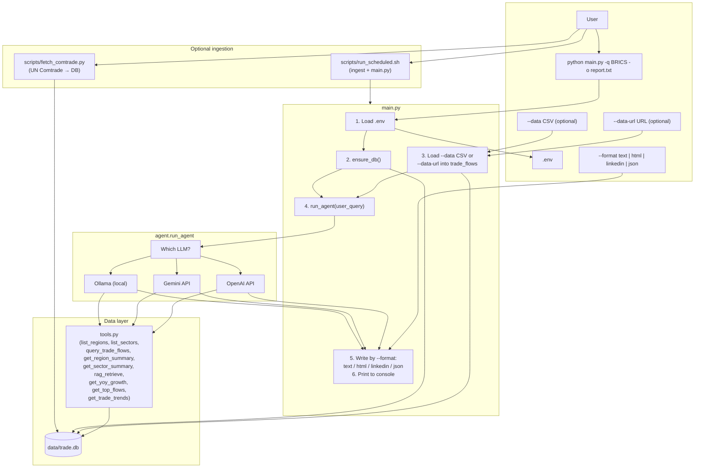
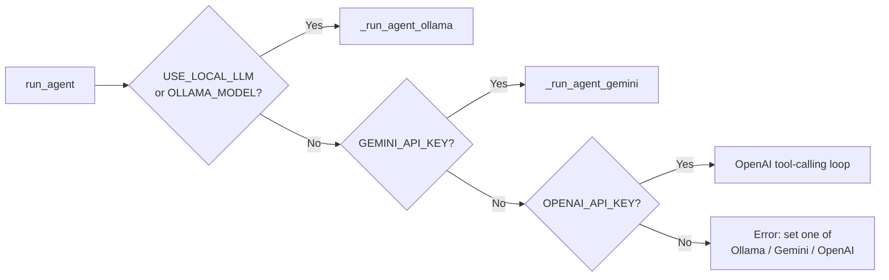
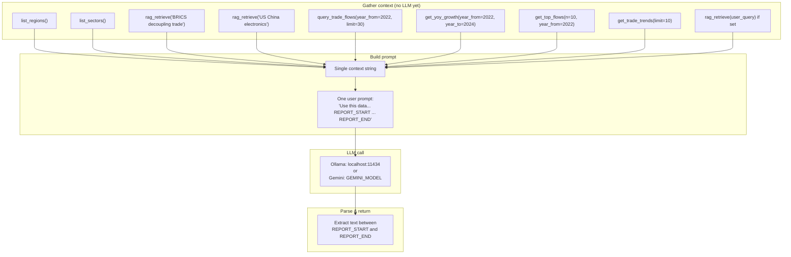
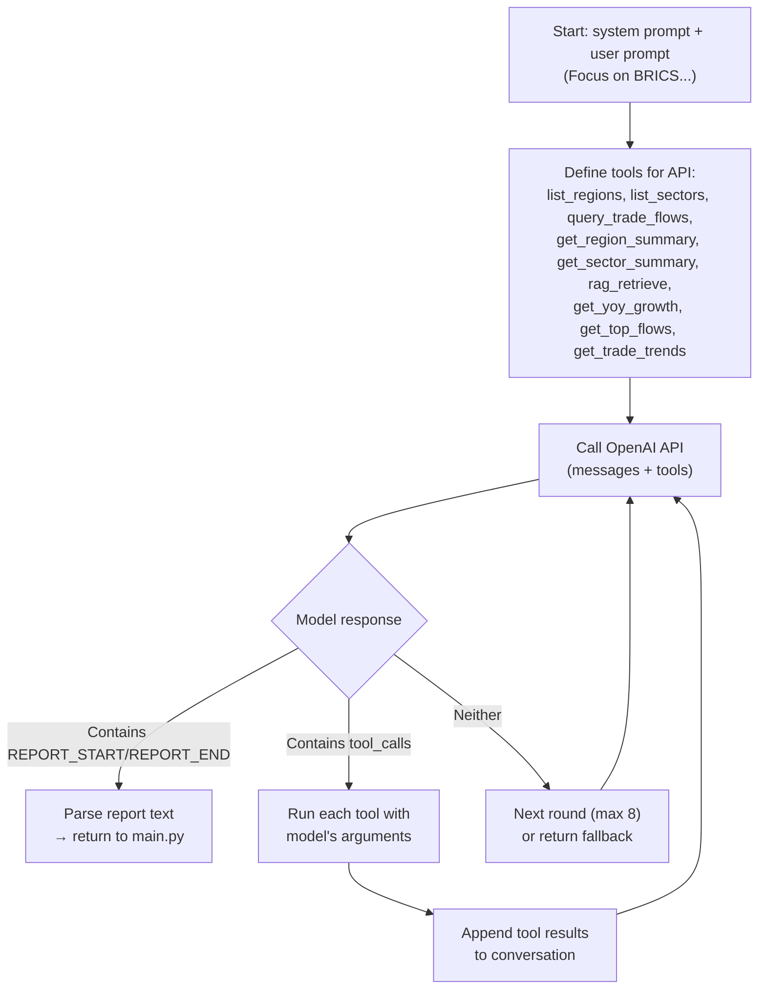
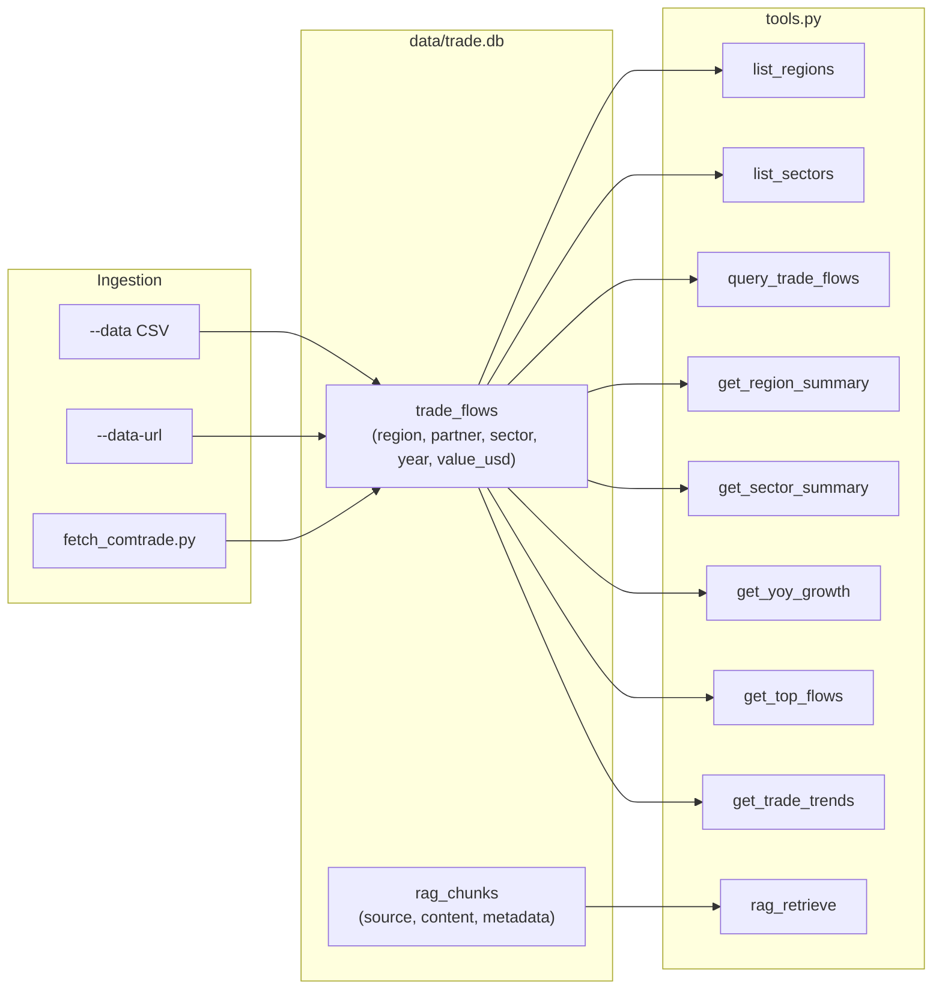
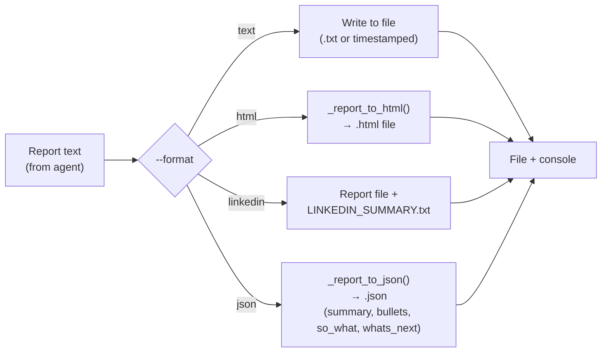
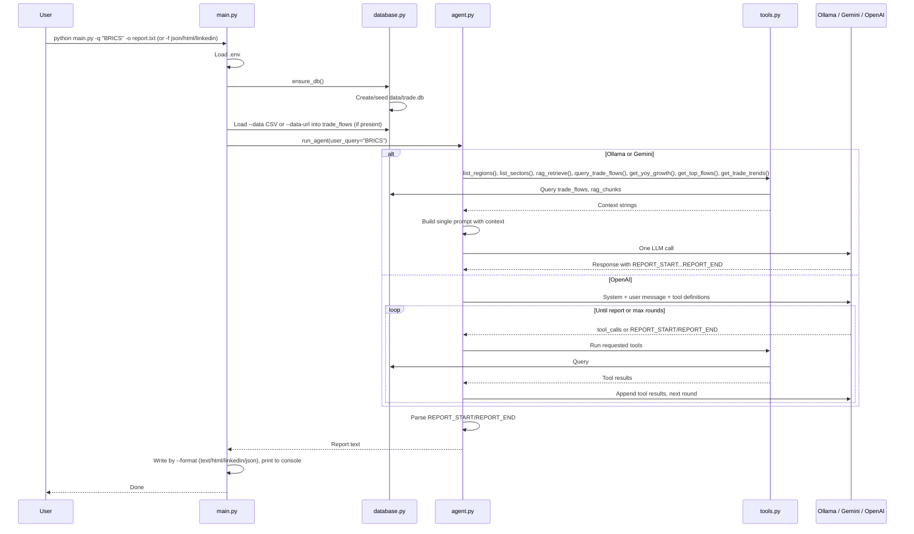

# AI Project — Logic Flow Diagram

**ASAN Macro:** CLI app that turns trade data (DB + optional CSV / CSV URL / UN Comtrade + focus query) into a sentiment report via an LLM (Ollama, Gemini, or OpenAI) and tools (DB + RAG + analysis). Output can be text, HTML, LinkedIn one-liner, or structured JSON. Optional scheduling (cron / GitHub Actions) runs ingestion + report.

---

## High-level flow

---

## LLM selection (agent entry)

---

## Ollama / Gemini path (single-prompt)

Context is gathered once by calling tools (including get_yoy_growth, get_top_flows, get_trade_trends); one prompt is sent to the LLM; report is parsed from the response.

---

## OpenAI path (multi-turn tool-calling)

The model decides when to call tools and when to output the final report. Tools include list_regions, list_sectors, query_trade_flows, get_region_summary, get_sector_summary, rag_retrieve, get_yoy_growth, get_top_flows, get_trade_trends.

---

## Data flow: tools and DB

All report data comes from the SQLite DB. Data can be ingested via main.py (--data, --data-url) or scripts/fetch_comtrade.py. Tools are either called by the agent (Ollama/Gemini) or by the model via the API (OpenAI).

---

## Output format flow (main.py after run_agent)

The report string is written according to --format.

---

## End-to-end sequence

---

## Summary

| Stage        | Action |
|-------------|--------|
| **Entry**   | `main.py` — CLI: `-q`, `-o`, `-d` (CSV), `--data-url`, `-f` (text \| html \| linkedin \| json). Optional: `scripts/fetch_comtrade.py` or `scripts/run_scheduled.sh`. |
| **Config**  | `.env` → API keys, `USE_LOCAL_LLM`, `OLLAMA_MODEL`, `OPENAI_MODEL`, `GEMINI_MODEL`, optional `COMTRADE_API_KEY`. |
| **DB / Ingest** | `ensure_db()` → `data/trade.db`. Optional: `--data` CSV, `--data-url`, or `scripts/fetch_comtrade.py` → `trade_flows`. |
| **Agent**   | `run_agent()` → Ollama → Gemini → OpenAI (else error). |
| **Ollama/Gemini** | Call tools (incl. get_yoy_growth, get_top_flows, get_trade_trends) → one prompt → one LLM call → parse report. |
| **OpenAI**  | Multi-turn; model calls tools → repeat until REPORT_START/REPORT_END. |
| **Output**  | Report → file by `-f` (text / html / linkedin + one-liner / json) + console. |

See **RUN_AND_LOGIC.md** for step-by-step run instructions and more detail.
