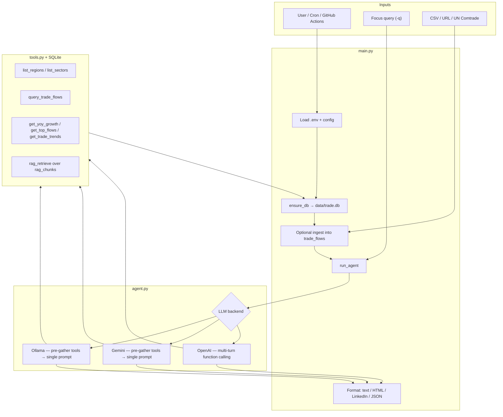

# ASAN Macro

**AI-powered trade analysis agent** · Tool-augmented LLM · Evaluation & safety scaffolding

**Built solo by Arnav Sahai** · AI Analyst & AI Security Analyst

I designed and implemented ASAN Macro end-to-end: data layer, analyst tools, multi-backend LLM agent, evaluation harness, adversarial safety checks, Comtrade ingest, and scheduled reporting. The system turns structured trade data into short, decision-ready **sentiment reports** with thematic synthesis, key regions/sectors, **so what**, and **what’s next**—grounding the LLM in SQLite, custom tools, and lightweight RAG rather than a generic chatbot paste.

> **Problem it solves:** Manual Comtrade → spreadsheet → generic LLM workflows are slow, inconsistent, and poorly grounded.  
> **Approach I built:** Ingest → query via tools → synthesize with a multi-backend agent → evaluate completeness and misuse resistance.

---

## Logical flow

End-to-end pipeline from user input to report:



### Step-by-step

| Step | Component | What happens |
|------|-----------|--------------|
| **1. Configure** | `config.py`, `.env` | Load API keys / Ollama settings. Backend priority: **Ollama → Gemini → OpenAI**. |
| **2. Persist** | `database.py` | Create/seed `data/trade.db` (`trade_flows`, `rag_chunks`) if missing. |
| **3. Ingest (optional)** | `data_ingestion.py`, `scripts/fetch_comtrade.py` | Load CSV, CSV URL, or UN Comtrade into the DB before analysis. |
| **4. Ground** | `tools.py` | Nine tools query structured flows and keyword RAG so the model reasons over **data**, not only priors. |
| **5. Reason** | `agent.py` | LLM synthesizes themes (e.g. BRICS, US–China, South–South). OpenAI uses a true tool-calling loop; Ollama/Gemini use deterministic pre-tooling + one synthesis call for portability. |
| **6. Deliver** | `main.py` | Extract `REPORT_START`…`REPORT_END` and write text / HTML / LinkedIn one-liner / structured JSON. |
| **7. Assure** | `evaluation/` | Completeness metrics across focus queries; adversarial cases for prompt leak, jailbreak-style, off-topic, and gibberish inputs. |
| **8. Operate** | GitHub Actions / cron | Optional scheduled ingest + report artifacts for recurring briefs. |

For diagrams and deeper run notes, see [LOGIC_FLOW_DIAGRAM.md](LOGIC_FLOW_DIAGRAM.md) and [RUN_AND_LOGIC.md](RUN_AND_LOGIC.md).

---

## Why I designed it this way

| Design choice | My rationale |
|---------------|--------------|
| **Tools over raw prompt stuffing** | Map analyst questions to named tools (YoY, top flows, trends)—clearer, testable, closer to production agents. |
| **Multi-backend orchestration** | Local Ollama for zero-quota demos; Gemini/OpenAI when quality or function calling matters. |
| **Structured report contract** | Fixed sections make outputs usable for briefs and measurable in evaluation. |
| **Evaluation + adversarial suite** | Treat agent quality and misuse resistance as engineering problems, not afterthoughts. |
| **CLI + artifacts first** | Keep the surface small while proving the full data → insight loop. |

---

## Quick start

```bash
pip install -r requirements.txt
cp .env.example .env   # configure one LLM backend
python main.py -q "BRICS" -o report.txt
# or: ./run.sh -q "BRICS" -o report.txt
```

### LLM backends (pick one)

| Backend | Setup | Best for |
|---------|--------|----------|
| **Ollama (recommended)** | `ollama pull qwen2:7b` · `.env`: `USE_LOCAL_LLM=1`, `OLLAMA_MODEL=qwen2:7b` | Local demos, no API quota |
| **Gemini** | `GEMINI_API_KEY=...` | Free-tier cloud runs |
| **OpenAI** | `OPENAI_API_KEY=...` | Full multi-turn tool calling |

### Common commands

```bash
python main.py -q "BRICS" -o report.txt
python main.py -q "US-China electronics" -d sample_trade.csv -o report.txt
python main.py -q "BRICS" -o report.html -f html
python main.py -o report.json -f json
python scripts/fetch_comtrade.py && python main.py -q "BRICS" -o report.txt
python evaluation/run_evaluation.py
python evaluation/adversarial_test.py
```

| Flag | Description |
|------|-------------|
| `-q` / `--query` | Focus the analysis (e.g. BRICS, US-China electronics) |
| `-o` / `--output` | Output path (default: timestamped report file) |
| `-d` / `--data` | Load CSV into DB before analysis |
| `--data-url` | Load CSV from a URL |
| `-f` | `text` \| `html` \| `linkedin` \| `json` |

---

## Architecture

```
ASAN_AI_Project/
├── main.py                 # CLI entry: ingest → agent → format output
├── agent.py                # LLM orchestration (Ollama / Gemini / OpenAI)
├── tools.py                # Nine analyst tools over SQLite + RAG
├── database.py             # Schema + seed data
├── data_ingestion.py       # CSV / URL / JSON ingest
├── config.py               # Env, paths, model helpers
├── evaluation/
│   ├── run_evaluation.py   # Completeness / runtime harness
│   └── adversarial_test.py # Misuse / injection-style probes
├── scripts/
│   ├── fetch_comtrade.py   # UN Comtrade → DB
│   └── run_scheduled.sh    # Ingest + report for cron
├── .github/workflows/
│   └── scheduled_report.yml
└── data/                   # trade.db created on first run
```

**Agent tools:** `list_regions`, `list_sectors`, `query_trade_flows`, `get_region_summary`, `get_sector_summary`, `rag_retrieve`, `get_yoy_growth`, `get_top_flows`, `get_trade_trends`.

---

## Evaluation & safety

| Practice | Location | Intent |
|----------|----------|--------|
| Completeness metrics (sections, length, runtime) | `evaluation/run_evaluation.py` | Measure report fitness across focus queries |
| Adversarial probes (prompt leak, jailbreak-style, off-topic, gibberish) | `evaluation/adversarial_test.py` | Surface misuse and grounding failures early |
| Secrets hygiene | `.env` / GitHub Actions secrets | No hardcoded API keys |
| Parameterized SQL | `tools.py` | Reduce injection risk in DB tools |
| HTML escaping | `main.py` | Safer rendered report artifacts |

Details: [EVALUATION_AND_SAFETY.md](EVALUATION_AND_SAFETY.md).

---

## Live data & scheduling

- **UN Comtrade:** [DOC_COMTRADE.md](DOC_COMTRADE.md) · `python scripts/fetch_comtrade.py`
- **Cron / Actions:** [SCHEDULING.md](SCHEDULING.md) · `scripts/run_scheduled.sh` · weekly workflow in `.github/workflows/`

---

## Google Colab

[](https://colab.research.google.com/github/Arnav504/ASAN_AI_Project/blob/main/colab_setup.ipynb)

1. Open the notebook → clone → `pip install -r requirements.txt`
2. Set `GEMINI_API_KEY` or `OPENAI_API_KEY` (Colab cannot run Ollama)
3. `!python main.py -q "BRICS" -o report.txt`

Prefer Colab **Secrets** over pasting keys into cells.

---

## Ownership

I completed this project alone: architecture, agent orchestration, tools/DB/RAG, ingestion and scheduling, evaluation and adversarial safety documentation, and portfolio-facing documentation. Interview talking points: [LINKEDIN_PROJECT.md](LINKEDIN_PROJECT.md).

---

## Proposed improvements

Roadmap I proposed to strengthen hiring and AI-expert appeal. Status: **proposed** (not yet implemented unless noted).

### Priority 0 — highest impact

| Change I proposed | Why I proposed it |
|-------------------|-------------------|
| Demo GIF / 60s screen recording in the README | Recruiters rarely clone; visual proof of the agent loop |
| Fix evaluation metrics (e.g. average word count) and commit live adversarial results with a configured LLM | Safety claims need evidence from real model runs |
| Unit tests (`pytest`) for `tools.py` (SQL filters, YoY, HTML escape) | Agent tools should be tested independently of the LLM |
| CI on PR: lint + unit tests + dry-run evaluation | Engineering discipline beyond notebook demos |

### Priority 1 — AI / agent credibility

| Change I proposed | Why I proposed it |
|-------------------|-------------------|
| Replace keyword RAG with embeddings + cite sources in reports | Move beyond “toy RAG”; prove groundedness to AI reviewers |
| Add groundedness / citation checks to the evaluation harness | Separate narrative fluency from factual fidelity |
| Structured output via JSON schema / Pydantic (keep delimiters as fallback) | Typed contracts match modern agent stacks |
| Prompt-injection guard on `-q` | Threat-model user input as an AI security analyst |
| URL allowlist for `--data-url` | Mitigate SSRF if the CLI is ever exposed as a service |
| Tool-call trace log (name, args, latency per run) | Agent observability for debugging and demos |

### Priority 2 — polish & differentiation

| Change I proposed | Why I proposed it |
|-------------------|-------------------|
| Optional thin FastAPI endpoint + auth token over the same agent core | Show a productization path without a rewrite |
| Dockerfile (+ optional Compose) for reproducible local runs | Lower friction for technical reviewers |
| Auto-append “machine-generated; verify against sources” disclaimer | Make responsible-AI practice concrete in every report |
| Short architecture note on dual Ollama vs OpenAI execution modes | Document intentional trade-offs |
| Sample report gallery (BRICS, US–China) with expected tool traces | Make quality tangible in-repo |
| Clarify goods-trade focus vs maritime branding (or add AIS later) | Avoid domain credibility gaps with experts |

### Current limitations (baseline I acknowledged)

| Current state | Direction I proposed |
|---------------|----------------------|
| Keyword RAG (`LIKE` over chunks) | Embedding retrieval + ranking |
| True tool loop on OpenAI; pre-tooling on Ollama/Gemini | Unified tool-calling where models support it |
| CLI + report artifacts | Optional thin API with auth and rate limits |
| Adversarial suite present | Always run against a live configured model in CI |
| Synthetic seed + optional Comtrade | Larger curated corpora + groundedness scoring |

---

## Skills demonstrated

LLM agents · function calling · RAG · prompt engineering · AI evaluation · adversarial / prompt-injection testing · secure secrets handling · SQL · data ingestion · Python · OpenAI / Gemini / Ollama · GitHub Actions

---

## License

Use as needed for academic and portfolio purposes. Keep API keys out of the repository.
